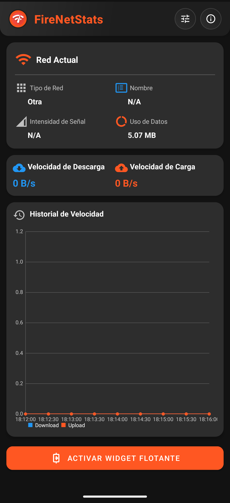
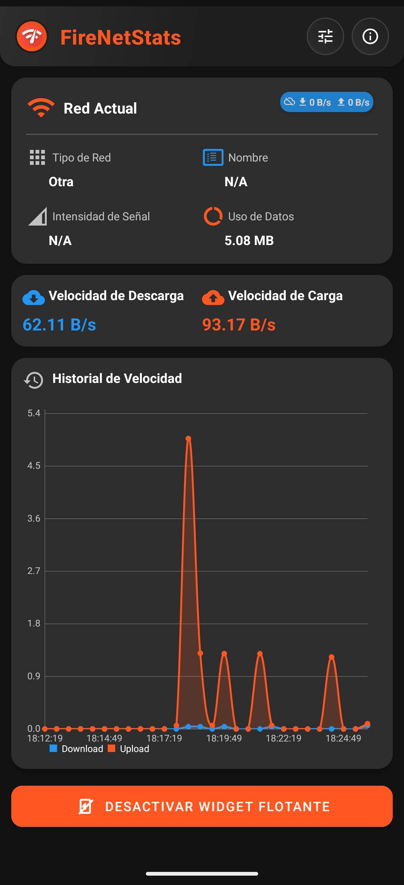
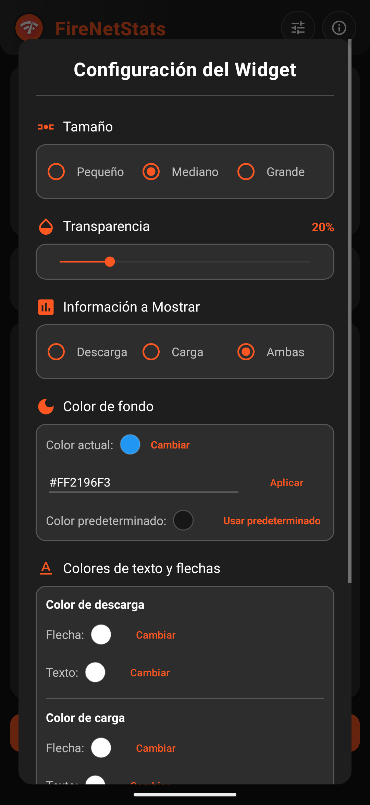

# FireNetStats 🔥📊  
**Monitor de Red en Tiempo Real para Android**  


## 📱 Descripción  
FireNetStats es una aplicación Android moderna y elegante que te permite monitorear las estadísticas de tu red en tiempo real. Con un widget flotante personalizable y una interfaz intuitiva, mantente siempre informado sobre tu velocidad de descarga, carga y el estado de tu conexión.  

---

## ✨ Características Principales  

### 🎯 **Monitoreo en Tiempo Real**  
- Velocidades de descarga y carga actualizadas cada segundo  
- Información detallada de la red actual (WiFi/Datos móviles)  
- Intensidad de señal y uso de datos  
- Historial gráfico de velocidades  

### 🎨 **Widget Flotante Personalizable**  
- **Tamaños:** Pequeño, Mediano, Grande  
- **Transparencia:** Ajustable de 0% a 100%  
- **Colores personalizados:** Fondo, texto y flechas  
- **Información mostrada:** Solo descarga, solo carga, o ambas  
- **Posición libre:** Arrastra el widget donde quieras  

### 🎪 **Interfaz Moderna**  
- Diseño Material Design 3  
- Soporte para tema claro y oscuro  
- Animaciones fluidas y transiciones suaves  
- Gráficos interactivos con MPAndroidChart  

### ⚙️ **Configuración Avanzada**  
- Paleta de colores completa con vista previa  
- Códigos de color personalizados (formato #AARRGGBB)  
- Configuración granular de cada elemento visual  
- Restablecimiento a valores predeterminados  

---

## 📸 Capturas de Pantalla  

| Vista Principal | Widget Flotante | Configuración |
|----------------|----------------|----------------|
|  |  |  |

---

## 🚀 Instalación  

### **Desde GitHub Releases**  
1. Ve a la sección [Releases](https://github.com/MaxCode93/FireNetStats/releases)  
2. Descarga la última versión del APK  
3. Instala en tu dispositivo Android  

### **Compilar desde el código fuente**  
```bash
git clone https://github.com/MaxCode93/FireNetStats.git
cd FireNetStats
./gradlew assembleDebug
```

---

## 🔧 Requisitos del Sistema  
- **Android:** 5.0 (API 21) o superior  
- **Permisos necesarios:**  
  - `SYSTEM_ALERT_WINDOW` - Para el widget flotante  
  - `ACCESS_FINE_LOCATION` - Para nombres de redes WiFi  
  - `READ_PHONE_STATE` - Para información de redes móviles  

---

## 🎮 Uso  

### **Activar el Widget Flotante**  
1. Abre FireNetStats  
2. Toca "Activar Widget Flotante"  
3. Concede el permiso de superposición si es necesario  
4. ¡El widget aparecerá en tu pantalla!  

### **Personalizar el Widget**  
1. Toca el ícono de configuración en la app principal  
2. Ajusta tamaño, transparencia y colores  
3. Usa la vista previa en tiempo real  
4. Guarda los cambios  

### **Interactuar con el Widget**  
- **Arrastra** para mover el widget  
- **Toca** para alternar entre modos de visualización  
- **Mantén presionado** para acceder a opciones rápidas  

---

## 🏗️ Arquitectura Técnica  

### **Tecnologías Utilizadas**  
- **Lenguaje:** Kotlin 100%  
- **UI:** Material Design Components, View Binding  
- **Gráficos:** MPAndroidChart  
- **Arquitectura:** MVVM con LiveData  
- **Servicios:** Foreground Service para monitoreo continuo  

### **Estructura del Proyecto**  
```
app/
├── src/main/java/cu/maxwell/firenetstats/
│   ├── MainActivity.kt              # Actividad principal
│   ├── WidgetSettingsActivity.kt    # Configuración del widget
│   ├── FloatingWidgetService.kt     # Servicio del widget flotante
│   ├── ColorAdapter.kt              # Adaptador para selector de colores
│   └── utils/
│       └── NetworkUtils.kt          # Utilidades de red
├── src/main/res/
│   ├── layout/                      # Layouts XML
│   ├── drawable/                    # Recursos gráficos
│   ├── values/                      # Colores, strings, estilos
│   └── values-night/                # Tema oscuro
└── build.gradle                     # Configuración de Gradle
```

---

## 🤝 Contribuir  
¡Las contribuciones son bienvenidas! Si quieres mejorar FireNetStats:  

1. Haz **fork** del repositorio  
2. Crea una rama para tu feature (`git checkout -b feature/AmazingFeature`)  
3. Haz commit de tus cambios (`git commit -m 'Add some AmazingFeature'`)  
4. Haz push a la rama (`git push origin feature/AmazingFeature`)  
5. Abre un **Pull Request**  

### **Reportar Bugs**  
Si encuentras un bug, por favor abre un **issue** con:  
- Descripción detallada del problema  
- Pasos para reproducir el bug  
- Información del dispositivo (modelo, versión de Android)  
- Screenshots si es posible  

---

## 👨‍💻 Autor  
**Maxwell**  
- [GitHub](https://github.com/MaxCode93)  
- [Facebook](https://facebook.com/MaxCode93)  

## 🙏 Agradecimientos  
- **MPAndroidChart** por los gráficos  
- **Material Design** por las guías de diseño  
- Comunidad de Android por el feedback y sugerencias
